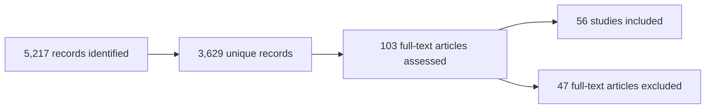

# Causal Root Cause Analysis in Software-Defined Systems: A Review with Context-aware Causal Observability as a Case Study 

Ousman Khan and Alaa Khamis  

  

> 📝 **Publication status:** Submitted to *IEEE Access, 2026*. This repository contains supplementary material for the submitted manuscript; it does not indicate acceptance or publication.

## 📖 Overview

Software-defined systems—including cloud-native and microservice platforms, software-defined networking, cyber-physical systems, the Internet of Things, and software-defined vehicles (SDVs)—are increasingly complex, distributed, and software-intensive. Conventional monitoring and observability approaches are effective at detecting anomalies, but their reliance on correlation can make it difficult to distinguish a true root cause from downstream symptoms.

This paper presents a **PRISMA-based systematic review of formal causal root cause analysis (RCA)** in software-defined systems. It classifies existing approaches by their level of causal formalism, examines the domains and telemetry sources in which they have been evaluated, and uses **context-aware causal observability for SDVs** as a representative case study.

The review finds substantial methodological progress in generic cloud and microservice environments, but much more limited adoption in domain-specific and safety-critical systems. In particular, causal RCA for SDVs remains at an early stage and has not yet made broad use of structural causal models or counterfactual reasoning.

## 🎯 Research questions

The systematic review addresses four questions:

1. **RQ1:** What formal causal RCA methods have been proposed for software-defined systems?
2. **RQ2:** Across which categories of software-defined systems have these methods been applied?
3. **RQ3:** What telemetry data, datasets, and evaluation strategies are used to validate these approaches?
4. **RQ4:** What methodological gaps, research trends, and future directions emerge from the literature?

## 🔬 Review methodology

The search covered publications from **January 2010 through June 2026** in IEEE Xplore, Scopus, and Web of Science.

Included studies explicitly model cause-and-effect relationships as part of diagnosis. Methods based only on statistical association, anomaly detection, heuristic dependency analysis, or black-box prediction without explicit causal structure were excluded.

### Causal-formalism taxonomy

| Level | Category | Description |
| :---: | --- | --- |
| **1** | Structural causal modeling | Structural causal models, interventions, counterfactual reasoning, do-calculus, invariant causal prediction, or equivalent formal mechanisms. |
| **2** | Probabilistic causal graphical models | Bayesian networks and related probabilistic graphical models used with explicit causal semantics. |
| **3** | Dependency-based causal approaches | Dependency graphs, temporal precedence, Granger causality, or propagation heuristics without fully defined structural causal semantics. |

## 💡 Main insights

- **Research is growing rapidly.** The earliest eligible study was published in 2016, with activity accelerating after 2021. Studies published in 2024 and 2025 represented **16.1%** and **23.2%** of the included literature, respectively.
- **Evidence is concentrated in generic software environments.** Domain-neutral software-defined systems accounted for **82.1%** of the reviewed studies; only **17.9%** addressed specific application domains.
- **SDVs are substantially underexplored.** Only **2 of 56 studies (3.6%)** focused on SDVs. Both used Level 2 probabilistic causal discovery; none applied Level 1 structural causal modeling or counterfactual analysis.
- **Metrics dominate observability data.** Metrics appeared in **46 of 56 studies**, while logs and distributed traces appeared in **22** and **19 studies**, respectively.
- **Multimodal diagnosis is emerging.** **23 studies** integrated at least two telemetry types, indicating movement toward multimodal causal reasoning.
- **Real-world validation remains limited.** Only **8 studies** reported evaluation using real operational systems; most relied on public benchmarks, simulations, synthetic environments, or controlled testbeds.
- **Reproducibility is a major gap.** Only **6 studies** satisfied the review's implementation-availability criterion; **50** did not provide publicly accessible code, data, or replication artifacts.

## 🚘 Why software-defined vehicles?

SDVs combine distributed software execution, cloud-edge communication, continuous over-the-air updates, heterogeneous physical and software telemetry, and stringent real-time and safety requirements. These characteristics make them a compelling—but difficult—domain for causal RCA.

The paper shows why diagnosis must account for operational context. The same telemetry pattern can imply very different causes depending on whether it occurs during an OTA update, regional network degradation, adverse weather, or thermal-management activity. Context-free diagnosis may therefore confuse expected adaptation with a software fault or attribute an external condition to an internal vehicle component.

### Requirements for SDV causal observability

- 🧭 **Context awareness:** OTA schedules, software versions, service-level objectives, network state, environmental conditions, and deployment zones.
- 🧩 **Multimodal integration:** Metrics, logs, traces, continuous profiling, CAN data, GPS, and physical sensor measurements.
- 🔁 **Intervention-aware reasoning:** Counterfactual questions such as, “What would happen if this OTA update were rolled back?”
- 🧪 **Validation infrastructure:** Controlled fault injection, ground truth, operational variation, and reproducible benchmarks.
- 🛡️ **Explainability and safety assurance:** Traceable and auditable diagnostic conclusions suitable for safety-critical environments.
- ⚡ **Real-time deployability:** Lightweight causal discovery and inference under onboard resource and timing constraints.

## 🧭 Research agenda

The paper identifies the following priorities for moving causal RCA from research prototypes into operational systems:

1. Integrate causal reasoning as a first-class capability within observability platforms.
2. Incorporate operational, environmental, and configuration context into causal models.
3. Develop open multimodal datasets and standardized benchmarking infrastructures.
4. Use digital twins and controlled interventions to validate causal hypotheses safely.
5. Design scalable, adaptive, and lightweight causal inference for streaming telemetry.
6. Produce transparent diagnostic explanations that can be audited in regulated and safety-critical settings.

## 📂 Supplementary materials

| File | Description |
| --- | --- |
| [S1.md](S1.md) | Complete database-specific search strategies for Scopus, Web of Science, and IEEE Xplore. |
| [S2.md](S2.md) | The 47 studies excluded after full-text assessment and the primary exclusion rationale for each. |
| [S3.md](S3.md) | Per-study and aggregate quality-assessment results for the 56 included studies, with linked references. |

## 🏷️ Keywords

`Causal AI` · `Causal inference` · `Root cause analysis` · `Observability` · `Distributed systems` · `Software-defined systems` · `Software-defined vehicles` · `Context-aware systems`

## 📄 Citation

The manuscript has been submitted to *IEEE Access*. Formal citation metadata will be added if and when the paper is published.

Until then, please refer to the manuscript by its title:

> O. Khan and A. Khamis, “Causal Root Cause Analysis in Software-Defined Systems: A Review with Context-aware Causal Observability as a Case Study,” submitted to *IEEE Access, 2026*.
